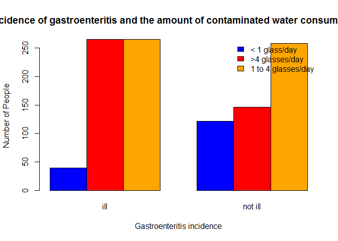

Assignment 6
================
Thando
29 August 2016

'Hello Octocat'
---------------

'I love Octocat.She's the coolest cat in town' 

``` r
data("anscombe")
dim(anscombe)
```

    ## [1] 11  8

``` r
names(anscombe)
```

    ## [1] "x1" "x2" "x3" "x4" "y1" "y2" "y3" "y4"

``` r
head(anscombe, n=6)
```

    ##   x1 x2 x3 x4   y1   y2    y3   y4
    ## 1 10 10 10  8 8.04 9.14  7.46 6.58
    ## 2  8  8  8  8 6.95 8.14  6.77 5.76
    ## 3 13 13 13  8 7.58 8.74 12.74 7.71
    ## 4  9  9  9  8 8.81 8.77  7.11 8.84
    ## 5 11 11 11  8 8.33 9.26  7.81 8.47
    ## 6 14 14 14  8 9.96 8.10  8.84 7.04

``` r
tail(anscombe, n=6)
```

    ##    x1 x2 x3 x4    y1   y2   y3    y4
    ## 6  14 14 14  8  9.96 8.10 8.84  7.04
    ## 7   6  6  6  8  7.24 6.13 6.08  5.25
    ## 8   4  4  4 19  4.26 3.10 5.39 12.50
    ## 9  12 12 12  8 10.84 9.13 8.15  5.56
    ## 10  7  7  7  8  4.82 7.26 6.42  7.91
    ## 11  5  5  5  8  5.68 4.74 5.73  6.89

``` r
summary(anscombe)
```

    ##        x1             x2             x3             x4    
    ##  Min.   : 4.0   Min.   : 4.0   Min.   : 4.0   Min.   : 8  
    ##  1st Qu.: 6.5   1st Qu.: 6.5   1st Qu.: 6.5   1st Qu.: 8  
    ##  Median : 9.0   Median : 9.0   Median : 9.0   Median : 8  
    ##  Mean   : 9.0   Mean   : 9.0   Mean   : 9.0   Mean   : 9  
    ##  3rd Qu.:11.5   3rd Qu.:11.5   3rd Qu.:11.5   3rd Qu.: 8  
    ##  Max.   :14.0   Max.   :14.0   Max.   :14.0   Max.   :19  
    ##        y1               y2              y3              y4        
    ##  Min.   : 4.260   Min.   :3.100   Min.   : 5.39   Min.   : 5.250  
    ##  1st Qu.: 6.315   1st Qu.:6.695   1st Qu.: 6.25   1st Qu.: 6.170  
    ##  Median : 7.580   Median :8.140   Median : 7.11   Median : 7.040  
    ##  Mean   : 7.501   Mean   :7.501   Mean   : 7.50   Mean   : 7.501  
    ##  3rd Qu.: 8.570   3rd Qu.:8.950   3rd Qu.: 7.98   3rd Qu.: 8.190  
    ##  Max.   :10.840   Max.   :9.260   Max.   :12.74   Max.   :12.500


``` r
library(readr) 
```

    ## Warning: package 'readr' was built under R version 3.2.5

``` r
 df <- read.csv("analgesic.csv")
```

``` r
 dim(df)
```

    ## [1] 40  5

``` r
 colnames(df)
```

    ## [1] "ID"            "Group"         "Measurement_1" "Measurement_2"
    ## [5] "Measurement_3"

``` r
 names(df)
```

    ## [1] "ID"            "Group"         "Measurement_1" "Measurement_2"
    ## [5] "Measurement_3"

``` r
 head(df ,n=6)
```

    ##   ID     Group Measurement_1 Measurement_2 Measurement_3
    ## 1  1 Analgesic            26            26            21
    ## 2  2 Analgesic            29            26            23
    ## 3  3 Analgesic            24            28            22
    ## 4  4 Analgesic            25            22            24
    ## 5  5 Analgesic            24            28            23
    ## 6  6 Analgesic            22            23            26

``` r
 tail(df ,n=6)
```

    ##    ID   Group Measurement_1 Measurement_2 Measurement_3
    ## 35 35 Placebo            17            21            15
    ## 36 36 Placebo            19            17            15
    ## 37 37 Placebo            14            19            13
    ## 38 38 Placebo            17            19            13
    ## 39 39 Placebo            11            20            18
    ## 40 40 Placebo            15            18            12

``` r
 summary(df)
```

    ##        ID              Group    Measurement_1   Measurement_2 
    ##  Min.   : 1.00   Analgesic:20   Min.   :10.00   Min.   : 8.0  
    ##  1st Qu.:10.75   Placebo  :20   1st Qu.:17.00   1st Qu.:17.0  
    ##  Median :20.50                  Median :20.00   Median :20.0  
    ##  Mean   :20.50                  Mean   :20.12   Mean   :20.7  
    ##  3rd Qu.:30.25                  3rd Qu.:24.00   3rd Qu.:25.0  
    ##  Max.   :40.00                  Max.   :30.00   Max.   :32.0  
    ##  Measurement_3  
    ##  Min.   :12.00  
    ##  1st Qu.:16.00  
    ##  Median :20.50  
    ##  Mean   :20.52  
    ##  3rd Qu.:24.25  
    ##  Max.   :30.00

``` r
library(tidyr)
```

    ## Warning: package 'tidyr' was built under R version 3.2.5

``` r
library(dplyr)
```

    ## Warning: package 'dplyr' was built under R version 3.2.5

    ## 
    ## Attaching package: 'dplyr'

    ## The following objects are masked from 'package:stats':
    ## 
    ##     filter, lag

    ## The following objects are masked from 'package:base':
    ## 
    ##     intersect, setdiff, setequal, union

``` r
#Tidy data wide to long format
df.data <- gather(df, Replicate_reading, Measurement, Measurement_1:Measurement_3)
#Group by Group Column
group_data <- group_by(df.data, Group)
group_data
```

    ## Source: local data frame [120 x 4]
    ## Groups: Group [2]
    ## 
    ##       ID     Group Replicate_reading Measurement
    ##    <int>    <fctr>             <chr>       <int>
    ## 1      1 Analgesic     Measurement_1          26
    ## 2      2 Analgesic     Measurement_1          29
    ## 3      3 Analgesic     Measurement_1          24
    ## 4      4 Analgesic     Measurement_1          25
    ## 5      5 Analgesic     Measurement_1          24
    ## 6      6 Analgesic     Measurement_1          22
    ## 7      7 Analgesic     Measurement_1          25
    ## 8      8 Analgesic     Measurement_1          28
    ## 9      9 Analgesic     Measurement_1          22
    ## 10    10 Analgesic     Measurement_1          18
    ## # ... with 110 more rows

``` r
#Group by the ID column 
group_id <- group_by(group_data, ID)
group_id
```

    ## Source: local data frame [120 x 4]
    ## Groups: ID [40]
    ## 
    ##       ID     Group Replicate_reading Measurement
    ##    <int>    <fctr>             <chr>       <int>
    ## 1      1 Analgesic     Measurement_1          26
    ## 2      2 Analgesic     Measurement_1          29
    ## 3      3 Analgesic     Measurement_1          24
    ## 4      4 Analgesic     Measurement_1          25
    ## 5      5 Analgesic     Measurement_1          24
    ## 6      6 Analgesic     Measurement_1          22
    ## 7      7 Analgesic     Measurement_1          25
    ## 8      8 Analgesic     Measurement_1          28
    ## 9      9 Analgesic     Measurement_1          22
    ## 10    10 Analgesic     Measurement_1          18
    ## # ... with 110 more rows

``` r
#Summarise multiple values to a single value
sum_data <- summarize(group_id, mean(Measurement))
#Print summary 
print(sum_data)
```

    ## # A tibble: 40 x 2
    ##       ID mean(Measurement)
    ##    <int>             <dbl>
    ## 1      1          24.33333
    ## 2      2          26.00000
    ## 3      3          24.66667
    ## 4      4          23.66667
    ## 5      5          25.00000
    ## 6      6          23.66667
    ## 7      7          26.66667
    ## 8      8          23.33333
    ## 9      9          22.66667
    ## 10    10          24.00000
    ## # ... with 30 more rows

Chunk 1
=======

CHICKEN WEIGHTS
===============

Null Hypothesis
---------------

-   No relationship exists between chick weight and the type of feed supplement.

Alternative Hypothesis
----------------------

-   The type of feed supplement given will have an effect on the chick weight.

``` r
library(tidyr)
library(dplyr)
library(ggplot2)
```

    ## Warning: package 'ggplot2' was built under R version 3.2.5

``` r
library(knitr)
```

    ## Warning: package 'knitr' was built under R version 3.2.5

``` r
# import dataset
chickweightscsv <- read.csv("chick-weights.csv")
chickweights <- tbl_df(chickweightscsv)
chickweights
```

    ## # A tibble: 71 x 2
    ##    weight      feed
    ##     <int>    <fctr>
    ## 1     179 horsebean
    ## 2     160 horsebean
    ## 3     136 horsebean
    ## 4     227 horsebean
    ## 5     217 horsebean
    ## 6     168 horsebean
    ## 7     108 horsebean
    ## 8     124 horsebean
    ## 9     143 horsebean
    ## 10    140 horsebean
    ## # ... with 61 more rows

``` r
# Explore data with plots
qplot(x = feed,
      y = weight,
      data = chickweights,
      geom = "boxplot",
      xlab = "Feed",
      ylab = "Weight (g)",
      main = "Chicken weights per feed supplement type")
```


``` r
# Statistical Test (Chick ANOVA)
ChickANO.VA <- aov(weight~feed, data = chickweights)
summary(ChickANO.VA)
```

    ##             Df Sum Sq Mean Sq F value   Pr(>F)    
    ## feed         5 231129   46226   15.37 5.94e-10 ***
    ## Residuals   65 195556    3009                     
    ## ---
    ## Signif. codes:  0 '***' 0.001 '**' 0.01 '*' 0.05 '.' 0.1 ' ' 1

``` r
# Comparing means of three or more groups

# State degree of freedom and p-value
Df =5 
"p-value <0.05"
```

    ## [1] "p-value <0.05"

``` r
"Reject null hypothesis and accept alternative hypothesis"
```

    ## [1] "Reject null hypothesis and accept alternative hypothesis"

``` r
# Correct for multiple comparisons using Bonferroni post hoc test
pairwise.t.test(chickweights$weight, chickweights$feed,
                p.adjust.method = 'bonferroni',
                paired = FALSE)
```

    ## 
    ##  Pairwise comparisons using t tests with pooled SD 
    ## 
    ## data:  chickweights$weight and chickweights$feed 
    ## 
    ##           casein  horsebean linseed meatmeal soybean
    ## horsebean 3.1e-08 -         -       -        -      
    ## linseed   0.00022 0.22833   -       -        -      
    ## meatmeal  0.68350 0.00011   0.20218 -        -      
    ## soybean   0.00998 0.00487   1.00000 1.00000  -      
    ## sunflower 1.00000 1.2e-08   9.3e-05 0.39653  0.00447
    ## 
    ## P value adjustment method: bonferroni

Chunk 2
=======

THE HOT ZONE
============

Null Hypothesis
---------------

-   There is no relationship between having gatroenteritis and consuming contaminated water.

Alternative Hypothesis
----------------------

-   Consuming contaminated water causes gastroenteritis.

``` r
# import dataset
gastroenteritiscsv <- read.csv("gastroenteritis.csv")
gastroenteritis <- tbl_df(gastroenteritiscsv)
head(gastroenteritis)
```

    ## # A tibble: 6 x 2
    ##       Consumption Outcome
    ##            <fctr>  <fctr>
    ## 1 < 1 glasses/day     ill
    ## 2 < 1 glasses/day     ill
    ## 3 < 1 glasses/day     ill
    ## 4 < 1 glasses/day     ill
    ## 5 < 1 glasses/day     ill
    ## 6 < 1 glasses/day     ill

``` r
tail(gastroenteritis)
```

    ## # A tibble: 6 x 2
    ##       Consumption Outcome
    ##            <fctr>  <fctr>
    ## 1 > 4 glasses/day not ill
    ## 2 > 4 glasses/day not ill
    ## 3 > 4 glasses/day not ill
    ## 4 > 4 glasses/day not ill
    ## 5 > 4 glasses/day not ill
    ## 6 > 4 glasses/day not ill

``` r
# Cross tabulate with xtabs
gastroenteritisX <- xtabs(~Consumption + Outcome,
      data = gastroenteritis)
gastroenteritisX
```

    ##                     Outcome
    ## Consumption          ill not ill
    ##   < 1 glasses/day     39     121
    ##   > 4 glasses/day    265     146
    ##   1 to 4 glasses/day 265     258

``` r
# plot gastroenteritisX
barplot(gastroenteritisX, beside = TRUE,
        main = "Relationship between incidence of gastroenteritis and the amount of contaminated water consumed by people in a small town",
        xlab = "Gastroenteritis incidence",
        ylab = "Number of People",
        col = c("blue", "red", "orange"))

par(xpd = TRUE)
legend("topright", c("< 1 glass/day", ">4 glasses/day", "1 to 4 glasses/day"), bty = "n", fill = c("blue", "red", "orange"))
```



``` r
# Statistics (Pearson's Chi-squared Test)
 Chisquared <- chisq.test(gastroenteritisX, correct = FALSE)
 Chisquared
```

    ## 
    ##  Pearson's Chi-squared test
    ## 
    ## data:  gastroenteritisX
    ## X-squared = 74.925, df = 2, p-value < 2.2e-16

Statistical Test
----------------

-   Pearson's Chi-square test
-   X-squared = 74.925, degrees of freedom = 2, p value &lt; 2.2e-16

### Test Assumptions:

-   Assessing if there is relationship between the two variables
-   Running an analysis on the variables
-   Data is unmatched
-   Variance is equal amongst groups

Outcome Analysis
----------------

-   A significant relationship (p&lt; 0.05) between the amount of contaminated water consumed and whether an individual had gastroenteritis was evaluated.The amount of contaminated water consumed was directly proportional to gastroenteritis cases.
-   Therefore reject the null hypothesis and accept the alternative hypothesis.

Chunk 3
=======

NAUSEA
======

Null Hypothesis
---------------

-   Administering 5HT3 receptor blocker does not relieve nausea intensity.

Alternative Hypothesis
----------------------

-   Administering 5HT3 receptor blocker decreases nausea intensity.

``` r
# import data set
nauseacsv <- read.csv("nausea.csv")
nausea <- tbl_df(nauseacsv)
nausea
```

    ## # A tibble: 8 x 3
    ##   Patient Nausea_before Nausea_after
    ##     <int>         <int>        <int>
    ## 1       1             3            2
    ## 2       2             4            0
    ## 3       3             6            1
    ## 4       4             2            3
    ## 5       5             2            1
    ## 6       6             4            1
    ## 7       7             5            0
    ## 8       8             6           40

``` r
# '40' in the data seems t be an error since te measure exceeds the pain scale.Therefore I have changed the value to be equal to '4' so that it falls within the region of the pain scale.

nausea[8,3] = 4
nausea
```

    ## # A tibble: 8 x 3
    ##   Patient Nausea_before Nausea_after
    ##     <int>         <int>        <dbl>
    ## 1       1             3            2
    ## 2       2             4            0
    ## 3       3             6            1
    ## 4       4             2            3
    ## 5       5             2            1
    ## 6       6             4            1
    ## 7       7             5            0
    ## 8       8             6            4

``` r
# plot dataset
plot(nausea$Nausea_before~nausea$Patient,
     col = "green",
     type = "o",
     ylim = c(0,6),
     ylab = "Nausea Rating",
     xlab = "Patient",
     main = "Intensity rating of nausea before and after administering 5HT receptor blocker")
lines(nausea$Nausea_after~nausea$Patient)
points(nausea$Nausea_after~nausea$Patient)
legend(4,6, c("Nausea before", "Nausea after"), fill = c("green", "black"))
```


``` r
# Statistical test (Wilcoxin Signed-rank test)
wilcox.test(nausea$Nausea_before, nausea$Nausea_after, paired = FALSE ,exact = FALSE)
```

    ## 
    ##  Wilcoxon rank sum test with continuity correction
    ## 
    ## data:  nausea$Nausea_before and nausea$Nausea_after
    ## W = 56.5, p-value = 0.01081
    ## alternative hypothesis: true location shift is not equal to 0

Statistical Test
----------------

-   Wilcoxin signed-rank test

### Test Assumptions:

-   The measurements were taken from the same sample group
-   The errors are independent
-   Matchin is effective

Outcome Analysis
================

-   Administering 5HT3 receptor blocker decreased the ratings of nausea intensity. Therefore, reject the null hypothesis.

Housing Prices
==============

Null hypothesis
---------------

-   There is no relationship between the interest rates and median house price USD housing prices.

Alternative hypothesis
----------------------

-   Interest rate affects median house price USD housing prices.

``` r
library(dplyr)
library(knitr)
library(tidyr)
library(ggplot2)

# Import and View dataset  
housing_prices <- read.csv("housing-prices.csv")
housing_prices
```

    ##    interest_rate median_house_price_USD
    ## 1             10                 183800
    ## 2             10                 183200
    ## 3             10                 174900
    ## 4              9                 173500
    ## 5              8                 172900
    ## 6              7                 173200
    ## 7              8                 173200
    ## 8              8                 169700
    ## 9              8                 174500
    ## 10             8                 177900
    ## 11             7                 188100
    ## 12             7                 203200
    ## 13             8                 230200
    ## 14             7                 258200
    ## 15             7                 309800
    ## 16             6                 329800
    ## 17            NA                     NA

``` r
interest = housing_prices$interest_rate
house_price = housing_prices$median_house_price_USD
head(cbind(interest,house_price))
```

    ##      interest house_price
    ## [1,]       10      183800
    ## [2,]       10      183200
    ## [3,]       10      174900
    ## [4,]        9      173500
    ## [5,]        8      172900
    ## [6,]        7      173200

``` r
# Exploring data with a plot
plot(interest,house_price,xlab = "interest_rate",ylab = "median_house_price_USD", pch= 23 ,col="blue",main = "Interest rate effect on housing prices")
abline(lm(housing_prices$median_house_price_USD ~ housing_prices$interest_rate,data = housing_prices), col="red", lwd= 2 )
```


``` r
##  Linear Regression 
housing_prices.reg <- lm(median_house_price_USD~interest_rate, data=housing_prices)
summary(housing_prices.reg)
```

    ## 
    ## Call:
    ## lm(formula = median_house_price_USD ~ interest_rate, data = housing_prices)
    ## 
    ## Residuals:
    ##    Min     1Q Median     3Q    Max 
    ## -55865 -31631 -16406  27212  80735 
    ## 
    ## Coefficients:
    ##               Estimate Std. Error t value Pr(>|t|)    
    ## (Intercept)     399229      74427   5.364 9.99e-05 ***
    ## interest_rate   -24309       9205  -2.641   0.0194 *  
    ## ---
    ## Signif. codes:  0 '***' 0.001 '**' 0.01 '*' 0.05 '.' 0.1 ' ' 1
    ## 
    ## Residual standard error: 43180 on 14 degrees of freedom
    ##   (1 observation deleted due to missingness)
    ## Multiple R-squared:  0.3325, Adjusted R-squared:  0.2848 
    ## F-statistic: 6.974 on 1 and 14 DF,  p-value: 0.01937

``` r
#Diagnostic plot 1
plot(x = housing_prices.reg$fitted.values,
     y = housing_prices.reg$residuals,
     main = "Homoskedasticity", 
     pch= 23 ,
     col = "blue",
     lwd= 2 )
abline(h = 0)
```


``` r
#Diagnostic plot 2 Gaussian residual distribution
qqnorm(housing_prices.reg$residuals)
qqline(housing_prices.reg$residuals)
```


``` r
#Binary outcome 
glm( housing_prices$median_house_price_USD ~ housing_prices$interest_rate,data = housing_prices)
```

    ## 
    ## Call:  glm(formula = housing_prices$median_house_price_USD ~ housing_prices$interest_rate, 
    ##     data = housing_prices)
    ## 
    ## Coefficients:
    ##                  (Intercept)  housing_prices$interest_rate  
    ##                       399229                        -24309  
    ## 
    ## Degrees of Freedom: 15 Total (i.e. Null);  14 Residual
    ##   (1 observation deleted due to missingness)
    ## Null Deviance:       3.91e+10 
    ## Residual Deviance: 2.61e+10  AIC: 390.8

State p-value and degrees of freedom
------------------------------------

-   p=0,0194
-   Df=14

Outcome analysis
----------------

-   Ran a linear regresion to check if there was a linear trend between x and y.
-   A qqplot to check if the residuals were normally distributed.
-   Homodeskedastic test to check if the resiuals had the same variance for all fitted values of x and y.

Test intepretation
------------------

-   The plot shows that an inverse linear reationship(p=0.02) exists between interest rate and housing prices.Therefore we can reject the null hypothesis.
-   The data is not homodskedastic which is a requirement of a linear regression and it does not fit the requirements of a gaussian residual distribution.The data didn't have an apparent linear relationship upon plotting.Therefore the data doesn't meet some of the requirements of a linear regression.
